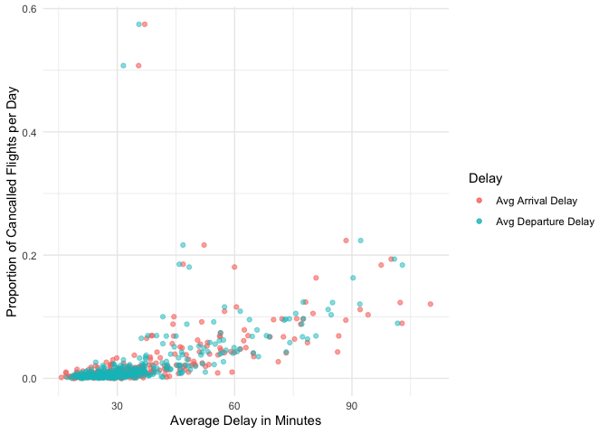

## Homework / in class exercise

### Q1. How many flights have a missing `dep_time`? What other variables are missing? What might these rows represent?

``` r
flights1 = flights %>% mutate(problem1 = case_when(
    is.na(dep_time) ~ 1,
    !is.na(dep_time) ~ 0
  )) %>% filter(problem1 == 1)

flights1 %>% 
  summarise(n = sum(problem1))
```

    ## # A tibble: 1 × 1
    ##       n
    ##   <dbl>
    ## 1  8255

There are 8255 of flights that have a missing `dep_time`.

``` r
flights1 %>%
  filter(problem1 == 1) %>% head()
```

    ## # A tibble: 6 × 20
    ##    year month   day dep_time sched_dep_time dep_delay arr_time sched_arr_time
    ##   <int> <int> <int>    <int>          <int>     <dbl>    <int>          <int>
    ## 1  2013     1     1       NA           1630        NA       NA           1815
    ## 2  2013     1     1       NA           1935        NA       NA           2240
    ## 3  2013     1     1       NA           1500        NA       NA           1825
    ## 4  2013     1     1       NA            600        NA       NA            901
    ## 5  2013     1     2       NA           1540        NA       NA           1747
    ## 6  2013     1     2       NA           1620        NA       NA           1746
    ## # … with 12 more variables: arr_delay <dbl>, carrier <chr>, flight <int>,
    ## #   tailnum <chr>, origin <chr>, dest <chr>, air_time <dbl>, distance <dbl>,
    ## #   hour <dbl>, minute <dbl>, time_hour <dttm>, problem1 <dbl>

If `dep_time` is a missing value, then usually the row also has missing
values for `dep_delay`, `arr_time`, `arr_delay`, and `air_time`. From
this information, we might guess that the rows that have missing value
for `dep_time` indicates flight cancellation.

### Q2. Currently `dep_time` and `sched_dep_time` are convenient to look at, but hard to compute with because they’re not really continuous numbers. Convert them to a more convenient representation of number of minutes since midnight.

``` r
flights2 = flights %>% 
  mutate(dep_time = (dep_time %/% 100) * 60 + dep_time %% 100,
         sched_dep_time = (sched_dep_time %/% 100) * 60 + sched_dep_time %% 100)

flights2 %>% head()
```

    ## # A tibble: 6 × 19
    ##    year month   day dep_time sched_dep_time dep_delay arr_time sched_arr_time
    ##   <int> <int> <int>    <dbl>          <dbl>     <dbl>    <int>          <int>
    ## 1  2013     1     1      317            315         2      830            819
    ## 2  2013     1     1      333            329         4      850            830
    ## 3  2013     1     1      342            340         2      923            850
    ## 4  2013     1     1      344            345        -1     1004           1022
    ## 5  2013     1     1      354            360        -6      812            837
    ## 6  2013     1     1      354            358        -4      740            728
    ## # … with 11 more variables: arr_delay <dbl>, carrier <chr>, flight <int>,
    ## #   tailnum <chr>, origin <chr>, dest <chr>, air_time <dbl>, distance <dbl>,
    ## #   hour <dbl>, minute <dbl>, time_hour <dttm>

### Q3. Look at the number of cancelled flights per day. Is there a pattern? Is the proportion of canceled flights related to the average delay? Use multiple dyplr operations, all on one line, concluding with `ggplot(aes(x= ,y=)) + geom_point()`.

``` r
# create a column that indicates if the flight is cancelled
# 1 indicates flight cancellation
flights2 %>%
    mutate(cancelled = case_when(
      is.na(dep_time) ~ 1,
      !is.na(dep_time) ~ 0
    )) %>%
  group_by(year, month, day) %>%
  summarise(avg_arr_del = mean(arr_delay[arr_delay > 0], na.rm=TRUE),
            avg_dep_del =  mean(dep_delay[dep_delay > 0], na.rm=TRUE),
            prop_cancelled = mean(cancelled)) %>%
  ggplot(aes(y=prop_cancelled)) + 
  geom_point(aes(x= avg_arr_del, color='Avg Arrival Delay'), alpha=0.6) +
  geom_point(aes(x= avg_dep_del, color='Avg Departure Delay'), alpha=0.5) + 
  xlab("Average Delay in Minutes") + 
  ylab("Proportion of Cancalled Flights per Day") + theme_minimal() +
  labs(color='Delay')
```



Notice that there is a positive correlation between average delays and
the number of cancelled flights per day, meaning that if certain days
have higher average delay then the proportion of cancelled flights is
likely to be high as well.
