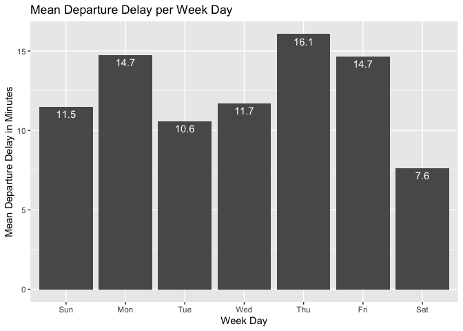
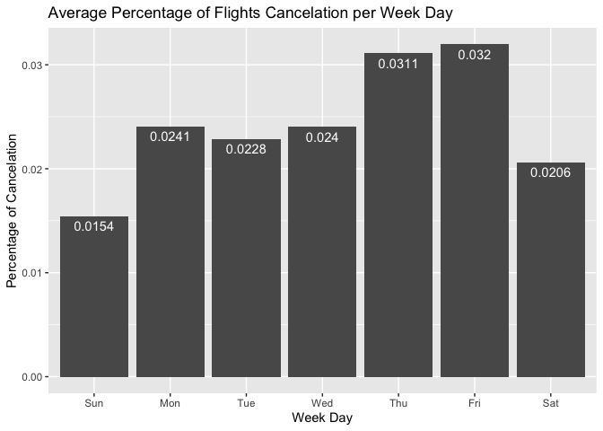
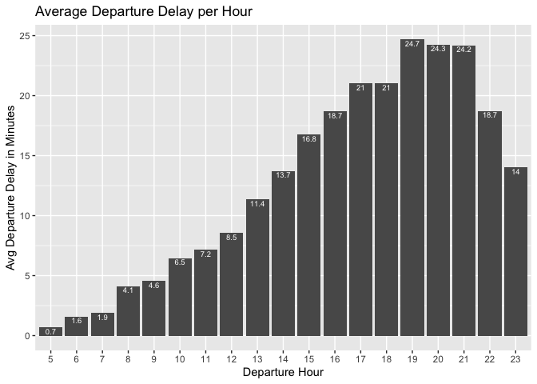
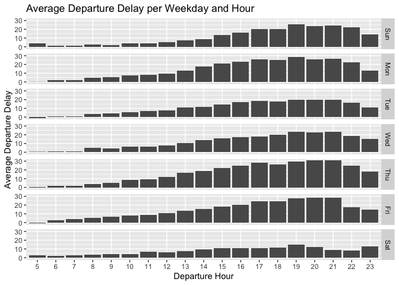
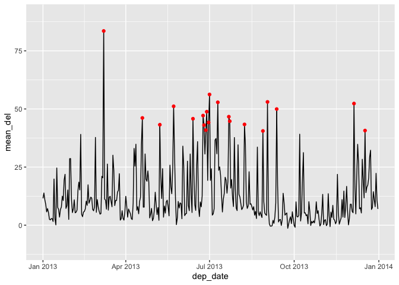
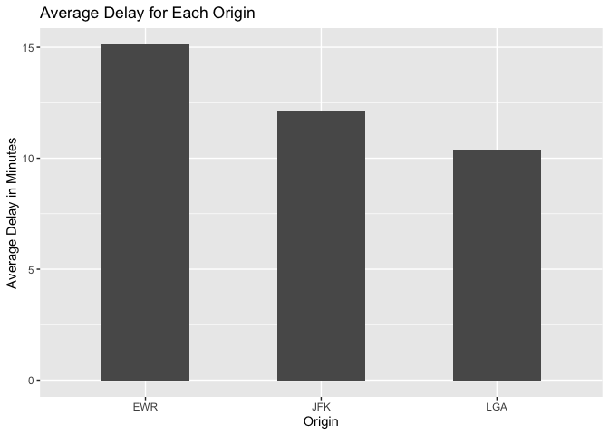
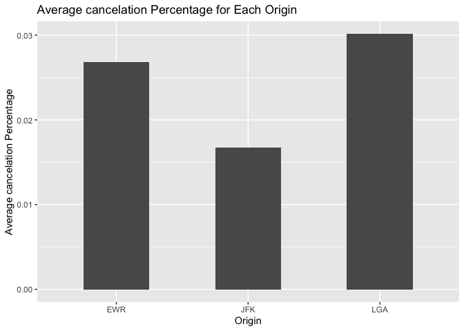
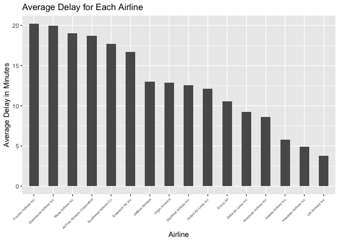
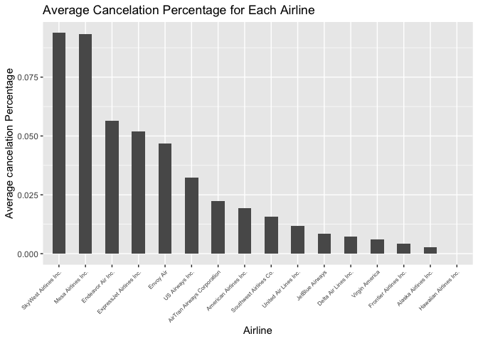

## Question

> What time of day should you fly if you want to avoid delays as much as
> possible? Does this choice depend on anything? Season? Weather?
> Airport? Airline? Find three patterns (“null results” are ok!). Write
> your results into Rmarkdown. Include a short introduction that
> summarizes the three results. Then, have a section for each finding.
> Support each finding with data summaries and visualizations. Include
> your code when necessary. This shouldn’t be long, but it might take
> some time to find the things you want to talk about and lay them out
> in an orderly way.

## Motivation

In this short report, I analyzed the `nycflights` data set to see if
there’s any pattern among flights delay. The readers of this report
should be able to see the pattern of the flights departure delay and cancelation based
on the three factors: departure day, weather, and the origin/airline of
the flight.

## Pattern 1) Based on General Departure Day and Hour

It would be reasonable to think that certain weekday could be more
hectic compared to the others for some reason. Based on the plot below,
notice that the Friday has the largest average delay of 16.1 minutes and
the Sunday has the lowest delay of about 7.6 minutes. The average
percentage of flights cancelation also peaks on the Friday with 0.032%
and 0.031% on the Thursday.

Departure Delay (Weekday)         |  Flights Cancelation Percentage (Weekday)
:-------------------------:|:-------------------------:
  |  

The distributions of the average delay based on hours / weekdays are as
follows.

Departure Delay (Departure Hour)         |  Cancelation Pct (Departure Hour)
:-------------------------:|:-------------------------:
  |  

## Pattern 2) Weather

Over the year, following dates (dates with red dots - let’s call these
dates ‘peak dates’) have the average departure delay greater than 40
minutes. Notice these dates have the average precipitation that is
almost 5 times greater than that of the other dates in inches. Also, the
visibility is shorter in about 1.3 miles than that of the others.
Interestingly, the average wind speed and pressure are actually lower on
these ‘peak’ dates.

The dates with the red dots on them are as follows:

    ## # A tibble: 2 × 5
    ##   is_peak avg_wind_speed avg_precip avg_pressure avg_visib
    ##   <chr>            <dbl>      <dbl>        <dbl>     <dbl>
    ## 1 0                 11.1    0.00374        1018.      9.33
    ## 2 1                 10.9    0.0179         1011.      8.00

Notice that the percentage of flights cancelation is almost 6 times
greater on the peak dates.

    ## # A tibble: 2 × 2
    ##   canceled     avg_wind_speed
    ##   <chr>                 <dbl>
    ## 1 canceled               13.2
    ## 2 not canceled           11.1

Let’s look up what happened on those peak dates. The dates are as
follows:

    ##  [1] "2013-03-08" "2013-04-19" "2013-05-08" "2013-05-23" "2013-06-13"
    ##  [6] "2013-06-24" "2013-06-25" "2013-06-27" "2013-06-28" "2013-06-30"
    ## [11] "2013-07-01" "2013-07-10" "2013-07-22" "2013-07-23" "2013-08-08"
    ## [16] "2013-08-28" "2013-09-02" "2013-09-12" "2013-12-05" "2013-12-17"

From the line graph with the red dots, we know that the two days with
the worst delays are March 08 and July 22.

-   March 8th, 2013 New York Weather - [Snow storm blankets New York
    City, leaving pretty scenes and a sloshy
    commute](https://www.nbcnews.com/news/photo/snow-storm-blankets-new-york-city-leaving-pretty-scenes-sloshy-flna1c8776255)

-   July 22th, 2013, at the LaGuardia Airport, there was a crash.
    [Southwest Airlines Flight
    345](https://en.wikipedia.org/wiki/Southwest_Airlines_Flight_345#:~:text=On%20July%2022%2C%202013%2C%20the,a%20result%20of%20the%20accident.&text=IATA%20flight%20No.&text=ICAO%20flight%20No.)
    So the delay was probably not due to the weather, but the accident.

## Pattern 3) Time and Day based on the Airport Origin

Now, let’s investigate if there are certain airports that have bad
delays compare to other airports.

First of all, the average flights delay and cancelation percentages for
each airport in New York City as as follows:

Departure Delay (Airport)         |  Cancelation Pct (Airport)
:-------------------------:|:-------------------------:
  |  

Let’s do the same analysis on the airlines. For the flights delay,
Frontier Airlines, Express Jet Airlines, and Mesa Airlines had the worst
delay in 2013. SkyWest Airlines, Mesa Airlines, and Endeavor Air Inc had
the worst flight cancelation percentage in 2013.

These following lists show that the ‘bad combination’ of airports and
airlines. First, we have a data with three airlines with the worst
average flights delay for each airport.

    ## # A tibble: 9 × 3
    ## # Groups:   origin [3]
    ##   origin name                     avg_del
    ##   <chr>  <chr>                      <dbl>
    ## 1 EWR    SkyWest Airlines Inc.       20.8
    ## 2 EWR    ExpressJet Airlines Inc.    20.2
    ## 3 EWR    Southwest Airlines Co.      17.9
    ## 4 JFK    Endeavor Air Inc.           19.0
    ## 5 JFK    ExpressJet Airlines Inc.    18.5
    ## 6 JFK    Virgin America              13.3
    ## 7 LGA    Frontier Airlines Inc.      20.2
    ## 8 LGA    ExpressJet Airlines Inc.    19.1
    ## 9 LGA    Mesa Airlines Inc.          19.0

Lastly, the following data shows the airlines with the worst average
percentage of flights cancelation for each airport.

    ## # A tibble: 9 × 3
    ## # Groups:   origin [3]
    ##   origin name                     avg_cancelation
    ##   <chr>  <chr>                              <dbl>
    ## 1 EWR    Envoy Air                         0.0738
    ## 2 EWR    Endeavor Air Inc.                 0.0536
    ## 3 EWR    ExpressJet Airlines Inc.          0.0493
    ## 4 JFK    ExpressJet Airlines Inc.          0.0582
    ## 5 JFK    Endeavor Air Inc.                 0.0551
    ## 6 JFK    Envoy Air                         0.0455
    ## 7 LGA    SkyWest Airlines Inc.             0.115 
    ## 8 LGA    Mesa Airlines Inc.                0.0932
    ## 9 LGA    Endeavor Air Inc.                 0.0665

## Conclusion

In this report, a preliminary analysis is done on the `nycflights` data
set to distinguish the pattern of flights delay and cancelation
percentage based on three factors: departure time, weather, and
airport/airlines. The Friday has the worst delay and flights cancelation
percentage. Also, try to avoid flights with the departure hour between
18:00 - 21:00.
