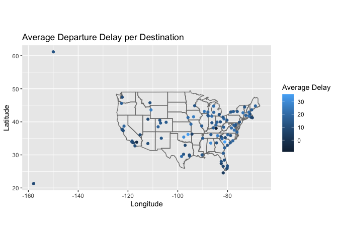
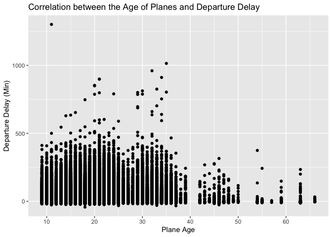
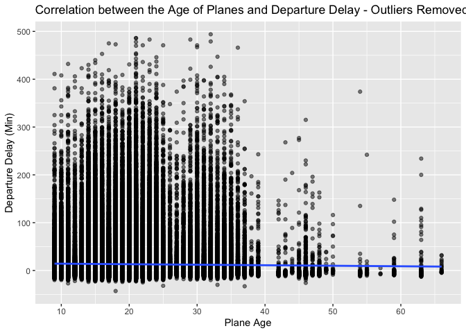
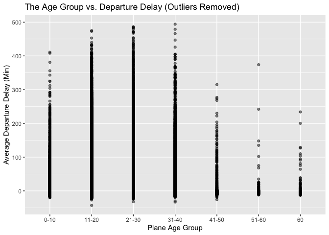
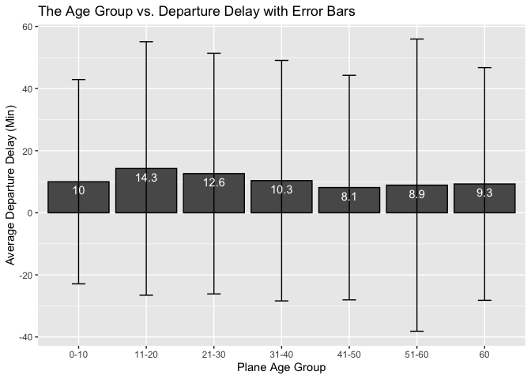

# Questions: Section 13.4.6 #1-3

## Exercise 1

> Compute the average delay by destination, then join on the airports
> data frame so you can show the spatial distribution of delays.

``` r
# the average delay by destination
flights %>%
  group_by(dest) %>%
  summarise(mean_del = mean(dep_delay, na.rm=T)) %>% 
  left_join(airports, by=c("dest"="faa")) %>%
  ggplot(aes(lon, lat)) +
    borders("state") +
    geom_point(aes(color=mean_del)) +
    coord_quickmap() + 
    xlab("Longitude") + 
    ylab("Latitude") + 
    ggtitle("Average Departure Delay per Destination") +
    labs(color="Average Delay")
```



## Exercise 2

> Add the location of the origin and destination (i.e. the lat and lon)
> to flights.

``` r
flights %>%
  left_join(airports %>% select(faa, lat, lon), by = c("origin"="faa")) %>%
  left_join(airports %>% select(faa, lat, lon), by = c("dest"="faa")) %>%
  rename(
    "origin_lat" = "lat.x",
    "origin_lon" = "lon.x",
    "dest_lat" = "lat.y",
    "dest_lon" = "lon.y"
  ) %>%
  select(origin, origin_lat, origin_lon, dest, dest_lat, dest_lon) %>% 
  head()
```

    ## # A tibble: 6 × 6
    ##   origin origin_lat origin_lon dest  dest_lat dest_lon
    ##   <chr>       <dbl>      <dbl> <chr>    <dbl>    <dbl>
    ## 1 EWR          40.7      -74.2 IAH       30.0    -95.3
    ## 2 LGA          40.8      -73.9 IAH       30.0    -95.3
    ## 3 JFK          40.6      -73.8 MIA       25.8    -80.3
    ## 4 JFK          40.6      -73.8 BQN       NA       NA  
    ## 5 LGA          40.8      -73.9 ATL       33.6    -84.4
    ## 6 EWR          40.7      -74.2 ORD       42.0    -87.9

## Exercise 3

> Is there a relationship between the age of a plane and its delays?

The first graph ‘naively’ plotted the scatter plot of the age of planes
and the departure delay of the flight. In the first glance, there seems
to be a negative linear relationship between them. However, it is not
safe to make such conclusion mainly because it might be just the
difference of the sizes: there are simply much more planes aged between
0 and 40 and, thus, they are more likely to have delays. Let’s remove
outliers - flights with delays greater than 500 minutes.

``` r
flights %>%
  left_join(planes %>% mutate(plane_age = 2022 - year) %>% select(tailnum, plane_age),
            by = "tailnum") %>%
  # ignoring missing values
  filter(!is.na(dep_delay) & !is.na(plane_age)) %>%
  ggplot(aes(x=plane_age, y=dep_delay)) + 
  geom_point() + 
  xlab("Plane Age") + 
  ylab("Departure Delay (Min)") + 
  ggtitle("Correlation between the Age of Planes and Departure Delay")
```



Notice that there is not a strong correlation between the age of planes
and delays from the plot below after removing outliers. Let’s
investigate further by creating a new column: age group.

``` r
flights %>%
  left_join(planes %>% mutate(plane_age = 2022 - year) %>% select(tailnum, plane_age),
            by = "tailnum") %>%
  filter(!is.na(dep_delay) & !is.na(plane_age) & dep_delay < 500) %>%
  ggplot(aes(x=plane_age, y=dep_delay)) + 
  geom_point(alpha=0.5) +
  geom_smooth(method="lm") +
  xlab("Plane Age") + 
  ylab("Departure Delay (Min)") + 
  ggtitle("Correlation between the Age of Planes and Departure Delay - Outliers Removed")
```

    ## `geom_smooth()` using formula 'y ~ x'



Notice the variance of delays for each plane age group differs
significantly. To take account for this difference, let’s compare the
mean delay for each group.

``` r
# create a data frame with planes age groups
plane_age_group = planes %>%
    mutate(plane_age = 2022 - year,
           age_group = case_when(
             plane_age >= 0 & plane_age <= 10 ~ "0-10",
             plane_age >= 11 & plane_age <= 20 ~ "11-20",
             plane_age >= 21 & plane_age <= 30 ~ "21-30",
             plane_age >= 31 & plane_age <= 40 ~ "31-40",
             plane_age >= 41 & plane_age <= 50 ~ "41-50",
             plane_age >= 51 & plane_age <= 60 ~ "51-60",
             plane_age >= 61 ~ "60"
             )) %>%
    select(tailnum, age_group) 

# join the data frames
flights %>% 
  left_join(plane_age_group, by = "tailnum") %>% 
  filter(!is.na(dep_delay) & !is.na(age_group) & dep_delay < 500) %>%
  ggplot(aes(x=age_group, y=dep_delay)) + 
  geom_point(alpha=0.5) + 
  xlab("Plane Age Group") + 
  ylab("Average Departure Delay (Min)") + 
  ggtitle("The Age Group vs. Departure Delay (Outliers Removed)")
```



Because of the large standard deviation of the departure delay for each
plane age group, it is hard to draw a conclusion if there’s any
significant correlation between the age and the average of departure
delay. Only with the average values, the planes with age between 11-20
has the highest mean delay with 14.3 minutes and those with age between
41-50 has the lowest average delay with 8.1 minutes.

``` r
# plotting bar graph with error lines
flights_summary %>%
  ggplot(aes(x=age_group,y=dep_delay)) + 
  geom_bar(stat="identity", color="black", 
           position=position_dodge()) +
  geom_errorbar(aes(ymin=dep_delay-sd, ymax=dep_delay+sd), width=.2,
                 position=position_dodge(.9)) +
  geom_text(aes(label = round(dep_delay,1)), vjust = 1.5, colour = "white") +
  xlab("Plane Age Group") + 
  ylab("Average Departure Delay (Min)") + 
  ggtitle("The Age Group vs. Departure Delay with Error Bars")
```


