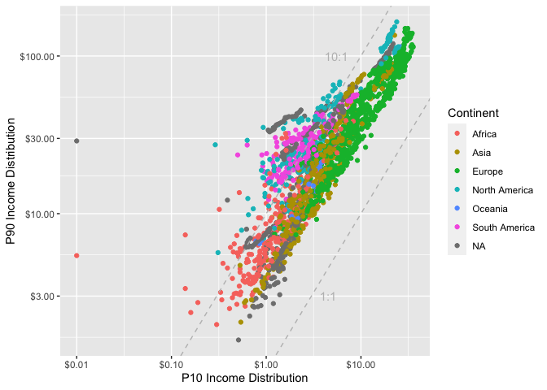

## Pre-Processing

First few rows of the raw data are as follows:

    ## # A tibble: 10 × 7
    ##    country     code       year   p90   p10 population continent
    ##    <chr>       <chr>     <dbl> <dbl> <dbl>      <dbl> <chr>    
    ##  1 Abkhazia    OWID_ABK   2015    NA    NA         NA Asia     
    ##  2 Afghanistan AFG      -10000    NA    NA      14737 <NA>     
    ##  3 Afghanistan AFG       -9000    NA    NA      20405 <NA>     
    ##  4 Afghanistan AFG       -8000    NA    NA      28253 <NA>     
    ##  5 Afghanistan AFG       -7000    NA    NA      39120 <NA>     
    ##  6 Afghanistan AFG       -6000    NA    NA      54166 <NA>     
    ##  7 Afghanistan AFG       -5000    NA    NA      74999 <NA>     
    ##  8 Afghanistan AFG       -4000    NA    NA     306250 <NA>     
    ##  9 Afghanistan AFG       -3000    NA    NA     537500 <NA>     
    ## 10 Afghanistan AFG       -2000    NA    NA     768751 <NA>

### Description on Data Measures

-   `country`: the name of the country
-   `code`: country code (3 capital letters)
-   `year`: the year in which the income distribution was recorded
-   `p90`: 90th income percentile
-   `p10`: 10th income percentile
-   `population`: estimated population of the country
-   `continent`: the continent to which the country belongs

Few rows of the cleaned data are as follows:

    ## # A tibble: 10 × 7
    ## # Groups:   country [10]
    ##    country           code   year    p90   p10 population continent
    ##    <chr>             <chr> <dbl>  <dbl> <dbl>      <dbl> <chr>    
    ##  1 Albania           ALB    2019  27.6   6.65    2873883 Europe   
    ##  2 Algeria           DZA    2011  15.1   4.49   36543548 Africa   
    ##  3 Angola            AGO    2000  14.5   1.18   16394067 Africa   
    ##  4 Argentina - urban <NA>   1986  69.8   9.82         NA <NA>     
    ##  5 Armenia           ARM    2016  15.1   3.7     2865841 Asia     
    ##  6 Australia         AUS    2014 115.   26.2    23469578 Oceania  
    ##  7 Austria           AUT    2019 111.   28.4     8879939 Europe   
    ##  8 Azerbaijan        AZE    2005  15.3   5.35    8656243 Asia     
    ##  9 Bangladesh        BGD    2016   7.62  2     159784576 Asia     
    ## 10 Belarus           BLR    2019  30.2  10       9673971 Europe

One of our final visualization will look something like this.

### Further Analysis

-   Income inequality based on the continents.
-   Any specific countries? (US, Canada, China, Europe, etc)
-   Any other interesting data to consider?
    -   [gdp per capita vs income
        inequality](https://ourworldindata.org/grapher/gdp-per-capita-vs-economic-inequality)
    -   [income
        inequality](https://ourworldindata.org/grapher/economic-inequality-gini-index)
    -   [share of population living in extreme
        poverty](https://ourworldindata.org/explorers/poverty-explorer)
