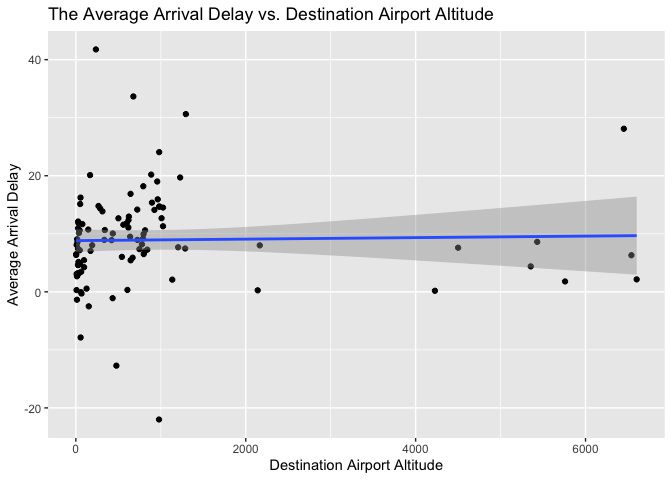
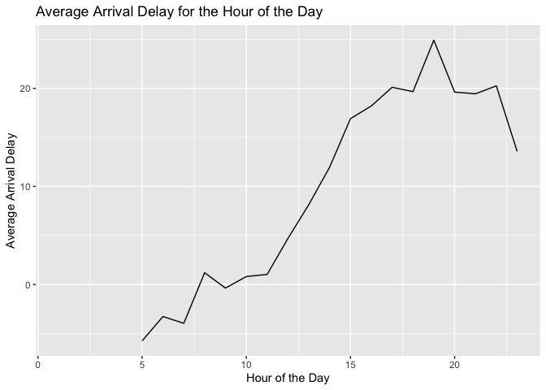
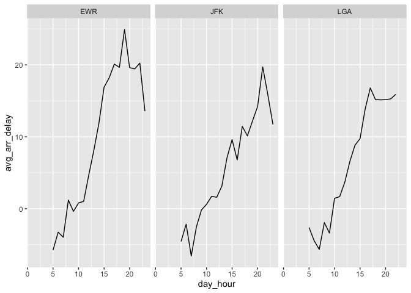
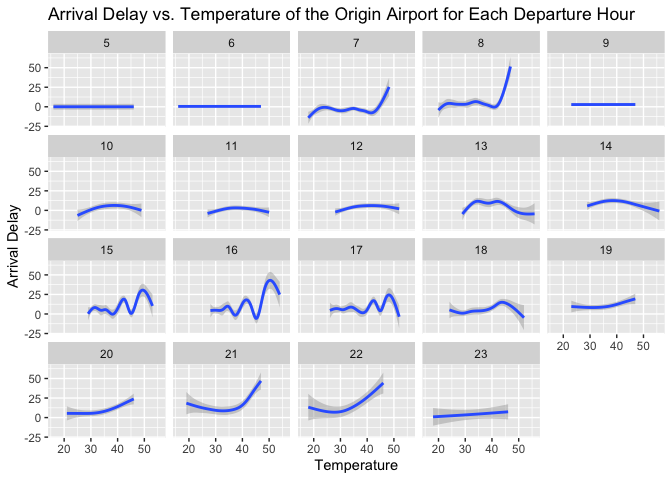

## Question 1

> Make a table that describes each plane. It should have a column for
> tailnum, another column for average arrival delay, and another for the
> year the plane was manufactured.

``` r
flights %>%
  group_by(tailnum) %>%
  summarise(avg_arr_delay = mean(arr_delay, na.rm=T)) %>%
  left_join(planes %>% select(tailnum, year), by = "tailnum") %>%
  arrange(desc(avg_arr_delay))
```

    ## # A tibble: 4,044 × 3
    ##    tailnum avg_arr_delay  year
    ##    <chr>           <dbl> <int>
    ##  1 N844MH           320   2002
    ##  2 N911DA           294   1995
    ##  3 N922EV           276   2003
    ##  4 N587NW           264   2002
    ##  5 N851NW           219   2004
    ##  6 N928DN           201     NA
    ##  7 N7715E           188   2005
    ##  8 N654UA           185   1992
    ##  9 N665MQ           175.    NA
    ## 10 N427SW           157   2001
    ## # … with 4,034 more rows

## Question 2

> Make a table where each row is a day of the year. The first column is
> the date. The 2:4 columns give the number of (scheduled) departures
> from EWR, LGA, and JFK.

``` r
flights %>%
  mutate(year_day = yday(time_hour)) %>%
  group_by(year_day, origin) %>%
  summarise(dep_num = n()) %>%
  pivot_wider(names_from = origin, values_from = dep_num)
```

    ## `summarise()` has grouped output by 'year_day'. You can override using the
    ## `.groups` argument.

    ## # A tibble: 365 × 4
    ## # Groups:   year_day [365]
    ##    year_day   EWR   JFK   LGA
    ##       <dbl> <int> <int> <int>
    ##  1        1   305   297   240
    ##  2        2   350   321   272
    ##  3        3   336   318   260
    ##  4        4   339   318   258
    ##  5        5   238   302   180
    ##  6        6   301   307   224
    ##  7        7   342   307   284
    ##  8        8   334   288   277
    ##  9        9   336   288   278
    ## 10       10   344   306   282
    ## # … with 355 more rows

## Question 3

> Make a table where each row is a day of the year. Each destination
> airport is a column. The elements (day x destination) give the number
> of flights to that destination. What should NA’s be?

All missing values should be 0 because in this case the implicit `NA`’s
indicate that there was no flight to the airport on that day of the
year.

``` r
q3 = flights %>%
    mutate(year_day = yday(time_hour)) %>%
    group_by(year_day, dest) %>%
    summarise(num_dep = n()) %>%
    pivot_wider(names_from = dest, values_from = num_dep)
```

    ## `summarise()` has grouped output by 'year_day'. You can override using the
    ## `.groups` argument.

``` r
# replace the missing values with 0
q3[is.na(q3)] = 0
  
q3 %>% head()
```

    ## # A tibble: 6 × 106
    ## # Groups:   year_day [6]
    ##   year_day   ALB   ATL   AUS   AVL   BDL   BNA   BOS   BQN   BTV   BUF   BUR
    ##      <dbl> <int> <int> <int> <int> <int> <int> <int> <int> <int> <int> <int>
    ## 1        1     3    40     6     1     2    10    25     3     7    16     2
    ## 2        2     3    51     7     1     2    11    26     3     9    16     2
    ## 3        3     2    49     6     0     1    11    30     3     6    13     2
    ## 4        4     2    48     6     0     1    11    30     3     7    13     2
    ## 5        5     2    35     4     0     2     8    21     3     8    15     2
    ## 6        6     2    41     5     0     1    13    29     3     7    12     2
    ## # … with 94 more variables: BWI <int>, CAK <int>, CHS <int>, CLE <int>,
    ## #   CLT <int>, CMH <int>, CRW <int>, CVG <int>, DAY <int>, DCA <int>,
    ## #   DEN <int>, DFW <int>, DSM <int>, DTW <int>, EGE <int>, FLL <int>,
    ## #   GRR <int>, GSO <int>, GSP <int>, HNL <int>, HOU <int>, IAD <int>,
    ## #   IAH <int>, IND <int>, JAC <int>, JAX <int>, LAS <int>, LAX <int>,
    ## #   LGB <int>, MCI <int>, MCO <int>, MDW <int>, MEM <int>, MHT <int>,
    ## #   MIA <int>, MKE <int>, MSN <int>, MSP <int>, MSY <int>, MYR <int>, …

## Question 4

> Of the planes built before 1980, what is the average flight distance?

``` r
flights %>% 
  select(tailnum, distance) %>% 
  left_join(planes %>% filter(year < 1980), by = "tailnum") %>%
  summarise(avg_flight_dist = mean(distance, na.rm=T))
```

    ## # A tibble: 1 × 1
    ##   avg_flight_dist
    ##             <dbl>
    ## 1           1040.

## Question 5

> Compute the average arrival delay for each destination airport. Plot
> this against the airports altitude.

``` r
flights %>%
  group_by(dest) %>%
  summarise(avg_arr_delay = mean(arr_delay, na.rm=T)) %>% 
  left_join(airports %>% select(faa, alt), by = c("dest" = "faa")) %>%
  ggplot(aes(x=alt, y=avg_arr_delay)) + 
  geom_point() +
  geom_smooth(method = "lm") + 
  xlab("Destination Airport Altitude") + 
  ylab("Average Arrival Delay") +
  ggtitle("The Average Arrival Delay vs. Destination Airport Altitude")
```

    ## `geom_smooth()` using formula 'y ~ x'

    ## Warning: Removed 5 rows containing non-finite values (stat_smooth).

    ## Warning: Removed 5 rows containing missing values (geom_point).



## Question 6

> Find the average arr_delay, by hour of the day, at EWR. Make a ggplot
> to show this.

``` r
flights %>%
  filter(origin == "EWR") %>%
  mutate(day_hour = hour(time_hour)) %>%
  group_by(day_hour) %>%
  summarise(avg_arr_delay = mean(arr_delay, na.rm=T)) %>%
  ggplot(aes(x=day_hour, y=avg_arr_delay)) + 
  geom_line() + 
  xlab("Hour of the Day") + 
  ylab("Average Arrival Delay") + 
  ggtitle("Average Arrival Delay for the Hour of the Day")
```

    ## Warning: Removed 1 row(s) containing missing values (geom_path).



## Question 7

> Find the average arr_delay, by hour of the day, for each of the 3
> origin airports. Make a faceted ggplot, one facet for each origin
> airport.

``` r
flights %>% 
  mutate(day_hour = hour(time_hour)) %>%
  group_by(origin, day_hour) %>%
  summarise(avg_arr_delay = mean(arr_delay, na.rm=T)) %>%
  ggplot(aes(x=day_hour, y=avg_arr_delay)) +
  geom_line() + 
  facet_wrap(~origin)
```

    ## `summarise()` has grouped output by 'origin'. You can override using the
    ## `.groups` argument.

    ## Warning: Removed 1 row(s) containing missing values (geom_path).



## Question 8

> Make a ggplot where the x axis is temperature and the y axis is delay
> in February. If you’ve done that, then facet by hour of the day and
> don’t plot points. Instead, just plot a smooth line.

``` r
flights %>%
  filter(month==2 & !is.na(arr_delay)) %>%
  left_join(weather %>% filter(month==2 & !is.na(temp)), by = c("origin", "year", "month", "day", "hour")) %>%
  ggplot(aes(x=temp, y=arr_delay)) +
  geom_smooth() + 
  facet_wrap(~hour) + 
  xlab("Temperature") + 
  ylab("Arrival Delay") + 
  ggtitle("Arrival Delay vs. Temperature of the Origin Airport for Each Departure Hour")
```

    ## `geom_smooth()` using method = 'gam' and formula 'y ~ s(x, bs = "cs")'

    ## Warning: Removed 29 rows containing non-finite values (stat_smooth).


